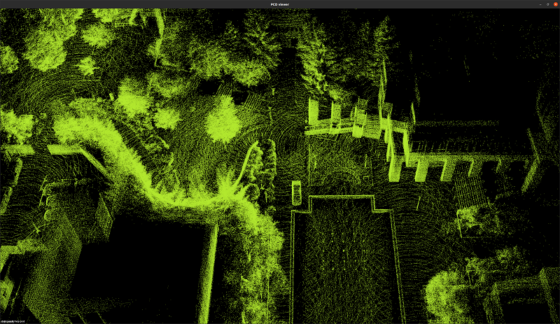
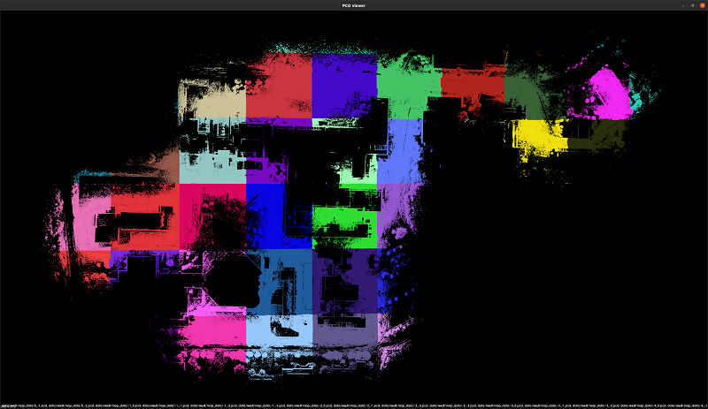
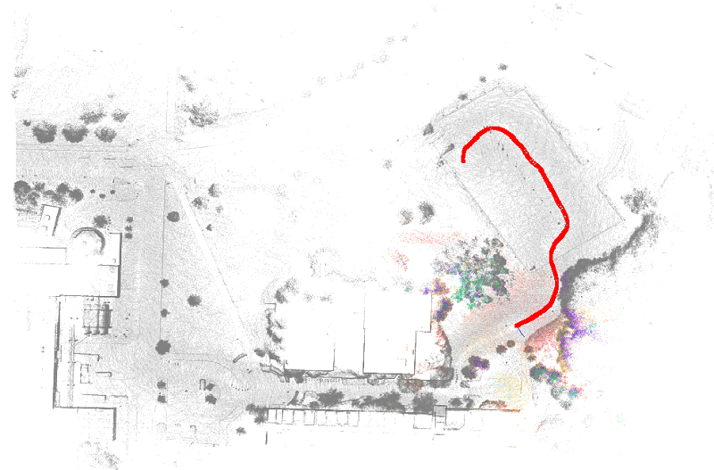

参考《自动驾驶与机器人中的SLAM技术》

## Features
- [ ] NDT 匹配度
- [ ] 2D 或2.5D 地图
- [ ] 减少/去除 NDT 计算矩阵中的零块
## 1. 前端 LIO
```bash
./bin/run_frontend --config_yaml ./config/mapping.yaml
# 生成地图
./bin/run_dump_map --pose_source=lidar
```
## 2. 第一轮优化，RTK 因子
```bash
./bin/run_optimization --stage=1
# 绘制地图
python3 scripts/all_path.py ./data/result/keyframes.txt
```
## 3. 第二轮优化，回环因子
```bash
./bin/run_optimization --stage=2
# 生成地图
./bin/run_dump_map --pose_source opti2
```

## 4. 地图导出，切片
```bash
./bin/run_split_map
# 查看地图
pcl_viewer data/result/map_data/*.pcd
```

## 5. 融合定位
```bash
./bin/run_fusion_offline
```

